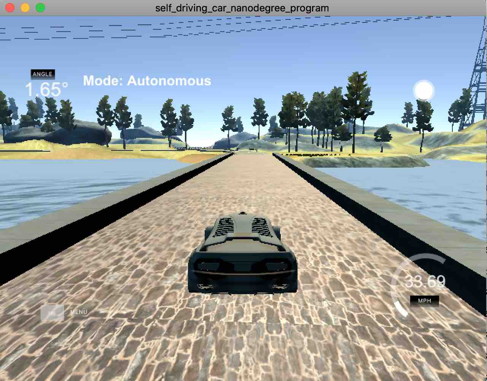
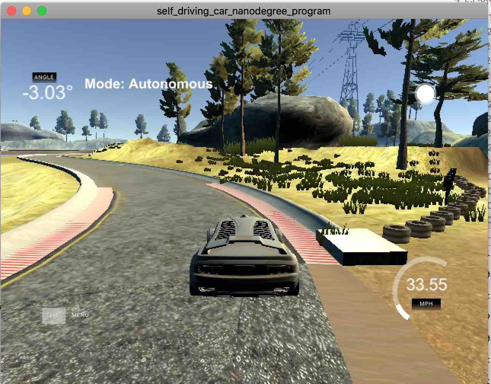

Reflection
--

## Describe the effect each of the P, I, D components had in your implementation
I did lots of experiments by passing different `Kp`, `Ki` and `Kd` through command line to the program and observe the performance. For example,
```
./pid -0.1 0 -4
```

Instead of hardcoding the values in the code, this allows me to quickly try different values without re-compilation.

Based on my experiments here's the conclution:
1. `Kp` is the proportional error term. Initially I tried bigger values for `Kp` but I find it makes the car oscillate baddly and running in lower speed.
2. `Ki` is the integral error term. I find it not really necessary in this project.
3. `Kd` is the derivative error term. I find it should be much larger than `Kp` to compensate the steering when the car is approaching the centerline.

Finally, I come up with the following values which is the default if no values are provided in the command line
```
Kp = -0.1
Ki = 0
Kd = -4
```

This allows the car to finish the lap safely at an average speed of 33.




## Describe how the final hyperparameters were chosen
Before manually experimenting with different PID values, I used the twiddle algorithm to find the values. Although it could find a combination of values and finish lap safely, it has serious drawback including low speed (~5) and constantly steering. The reason is the PID value it calculates are very large, making the car steer heavily even it's very close the centerline.

Then I give it up and try manually tuning the PID values through experiments. At first, I chose 

```
Kp = -1
Ki = 0
Kd = -1
```

It works much better than using Twiddle but still the car oscillates badly. Then I lower the `Kp` to `0.2` and increase `Kd` to `2` and got significantly better results. I continue this approach until I reach the values above.